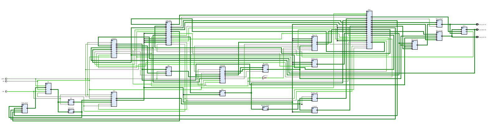
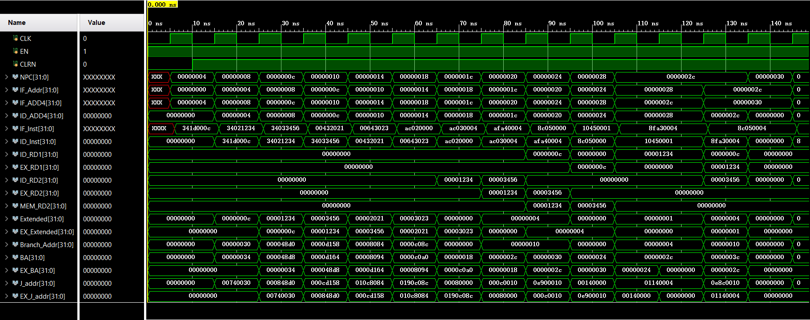
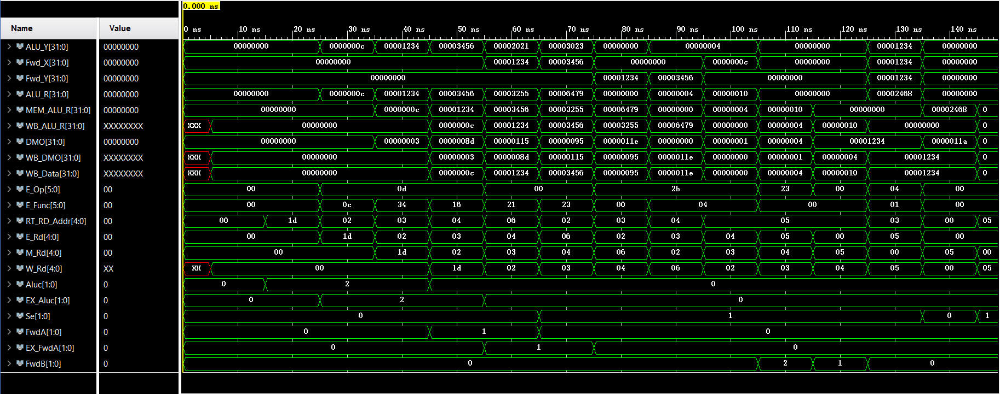
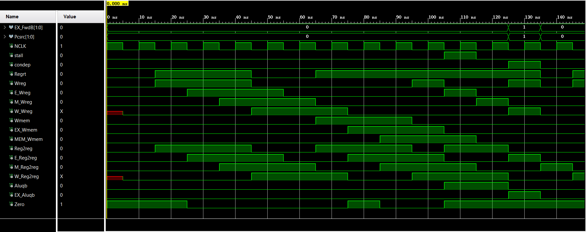

# CPU design by Firefox2100

## Introduction

This design is an experiment assignment to implement a 5-stage pipeline CPU, and attempt to utilize certain methods to improve its performance. The total development time is about 40 hours, separated in 8 weeks. This design is developed under Windows 10 Operating System (64 bit) and Ubuntu 20.04 (64 bit), and via Vivado™ Design Suite 2019. No patented IP core is used in the design, nor does it contain any commercial design. The entire project is under GNU GPL v3.0, and is open-sourced at [My GitHub repo](https://github.com/Firefox2100/CPU_Design).

## Specifications

This is a 32 bit CPU, currently implementing the subset of MIPS command set of 7 different commands as: add, sub, ori, lw, sw, beq, j. Under FPGA verification, this design can function under 600 MHz clock speed. It is also customizable, capable of easily adding the support of other 32 bit MIPS command support easily with minimal modification of the modules.

## Block Diagram

The PDF version with higher resolution is in the ``/Document`` folder of this repository. The basic data path design is that the instruction goes through IF, ID, EX, MEM, WB five stages, and EX and MEM stage is capable of push its data forward to previous stages to solve potential hazard.

## Precautions to avoid hazard

### Control hazard

The control hazard is the trickiest part of a CPU design. Unfortunately I’m not capable to design as complicated structure as re-arranging the instruction or branch prediction, so I used the most common solution, which is to halt the pipeline for two cycles, until the ALU is finished with the comparison. Then, wipe the IF-ID and ID-EX buffing registers to synchronize the pipeline, so that the CPU may proceed to the next instruction without the interference of this halt.

### Data hazard

In this design, effective methods have been taken to minimize the influence of data hazard. Including:

#### Reverse the RegFile clock

As can be seen in the block diagram, the clock of the register file is reversed. This would let the register file write the data at the positive edge of the negative clock, which is actually the negative edge of the main clock. The register separating MEM and WB has already hold the value at the positive edge of the main clock, so this design allows the register fie to write the value back half a cycle earlier than the possible read request coming up, thus eliminate the data hazard on WB stage.

Credit: this design is inspired by a fellow developer goes by the name: Ace Cheney.

#### Data forwarding mechanism

The design allows the values in the EX-MEM and MEM-WB register, which is the value coming out of the ALU or Data Memory, to be directly pushed to the input of the ALU. This can eliminate the data hazard in the case that ALU requires the value of the previous two instructions, without halting the CPU.

#### CPU halting

However, the previous design doesn’t mean that CPU doesn’t need to be halted when encounter a data hazard. The lw command may requires the value from last instruction, which has not yet been calculated. Should this be the case, the CPU is forced to halt for one cycle, until the value is calculated by ALU. Then the register between ID and EX is cleared to synchronize the pipeline.

### Structural hazard

This CPU design won’t encounter the structural hazard, for two reasons.

Firstly, it has separated module, a separated 32-bit CLA, to process the address calculation, rather than use the ALU.

Secondly, all instruction that comes in the CPU must proceed through all five stages of the pipeline, no extra power is consumed here, because the corresponding stage doesn’t actually do any extra work, the data simply goes through the buffing registers to synchronize the pipeline. So, no two instruction would require to use the ALU, or any other stage at the same time.

## Control signal generation and spreading

The control unit is a purely combinational logic module, which makes it easier to operate, because it only depends on the current state of each stage. This renders the extra effort to restore the state machine used in most other CPU unnecessary, when a halt is required. However, this makes synchronizing the control signal and the instruction and data flow difficult. So, I alter the regular data path, to let not just the data, but also the instruction and the control be buffed in the registers. This ensures that they’re all in sync.

## Behavioral Simulation

The complete waveform file is in the ``/Document`` folder of this repository.

